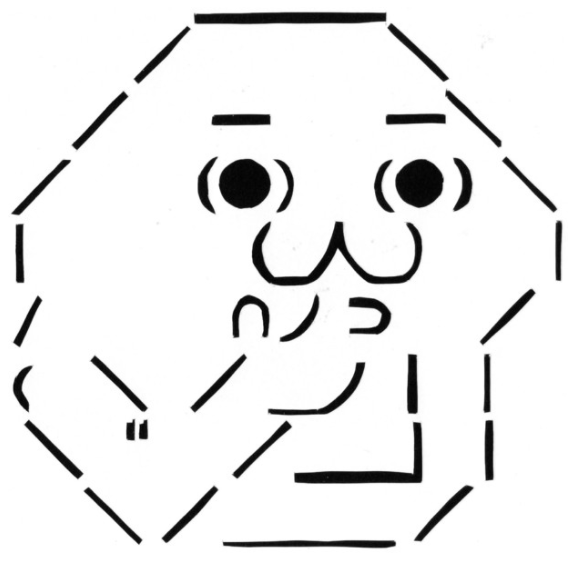

# yaruo-diary

別リポジトリ:yaruo-start-template を起点に React アプリケーションを構築します。

## ステップ毎にブランチを分けてあります。

<dl>
  <dt>
    01_install-MUI
  </dt>
  <dd>Google推奨のMaterial Designを使用したReactUIライブラリのインストール</dd>
  <dt>
    02_Component-Cardboard
  </dt>
  <dd>データの一覧表示を行う</dd>
  <dt>
    03_refactoring_initialData
  </dt>
  <dd>初期データを別ファイルにする</dd>
  <dt>
  04_refactoring_DiaryHeader
  </dt>
  <dd>カードヘッダを別コンポーネントにする</dd>
  <dt>
  05_Create-DiaryForm
  </dt>
  <dd>入力用フォームを作成する</dd>
  <dt>
  06_implements_data_save
  </dt>
  <dd>データの追加・編集・削除の機能を実装する</dd>
  <dt>
  07_install-redux
  </dt>
  <dd>状態管理にReduxを使う</dd>
  <dt>
  08_install-redux-toolkit
  </dt>
  <dd>redux-toolkitで楽々</dd>
</dl>
